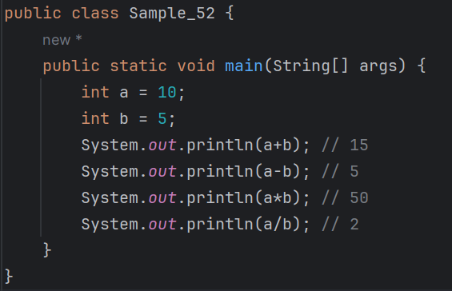
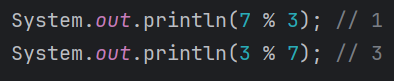
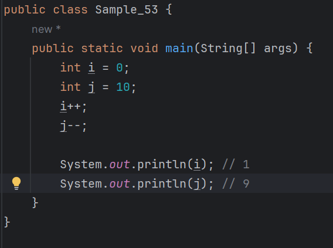
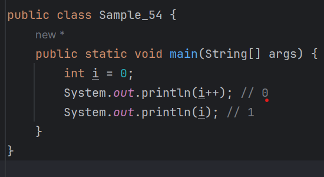
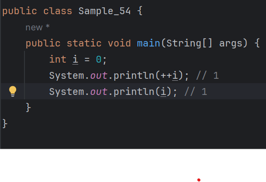

# 03-1 숫자
* 숫자 자료형은 숫자 형태로 이루어지며 우리가 익숙히 알고 있는 것들이다.
* 1,2,3과 같은 정수, 12,34 같은 실수, 드물게 쓰이지만 8진수나 16진수 같은 것들도 있다.
* 자바에서 이런 숫자들을 어떻게 사용하는지 알아보자.

### 정수
* 자바에서 정수를 표현하는 자료형은 int, long이다.
  - int와 long은 표현할 수 있는 숫자의 범위에 차이가 있다.

| 자료형 | 표현 범위                                       |
|---|---------------------------------------------|
|int| -2134483648 ~ 2147483647                    |
|long| -9223372036854775808 ~ 9223372036854775807  |
* byte, short 등도 있지만 잘 사용하지 않는다.
  - 효율적인 메모리 사용이 필요한 경우에 사용함

<b>int와 long을 사용한 예를 살펴보자.</b>
```
  int age = 10;
  long countOfStar = 8764827384923849L; <- 이렇게 붙여준다
```
* long 자료형 변수에 값을 대입할 때 int 자료형의 최댓값인 2147483647보다 크면 8764827384923849L처럼 끝에 접미사로 L 자를 붙여 주어야 한다.
  - 만약 큰 숫자에 접미사 L을 누락하면 컴파일 오류가 발생한다.<br>

<b>참고)</b>
* 알파벳 대문자 L 대신 소문자 I도 사용할 수 있지만 숫자 1과 비슷해서 헷갈릴 수 있어서 추천하지 않는다.
---
### 실수
<b> 자바에서 실수를 표현하는 자료형은 float, double이다.<br></b>
<b> float와 double 역시 표현할 수 있는 숫자의 범위에 차이가 있다.</b>

| 자료형 | 표현 범위 |
|---|---|
|float|-3.4 * 10³⁸ ~ 3.4 * 10³⁸|
|double|-1.4 * 10³⁰⁸ ~ 1. * 10³⁰⁸|
* float와 double을 사용한 예를 살펴보자.
```
  float pi = 3.14F;
  double morePi = 3.14159265358979323846;
```
* 자바에서 실수형은 기본값이 double이므로 앞의 예에서 보듯이 float 변수에 값을 대입할 때에는 3.14F처럼 끝에 접미사로 F자를 꼭 붙여 주어야 한다.
  - float 자료형에 값을 대입할 때 접미사를 누락하면 컴파일 오류가 발생함.
  - 대문자 F대신 소문자 f를 사용해도 된다.

<b> 실수는 지수 표현식으로 다음과 같이 사용할 수도 있다.</b>

```
double d1 = 123.4;
double d2 = 1.234e2;
```
* d1과 d2의 값은 123.4로 같다.
  - d2의 e2는 10의 제곱(10²)을 의미한다.
  - 즉, 1.234 * 10²이 되어 123,4가 되는 것이다.

### 8진수와 16진수
* 8진수와 16진수는 int자료형을 사용한다.
  - 숫자 0으로 시작하면 8진수, 숫자 0과 알파벳 x로 시작하면 16진수가 된다.
  - 8진수와 16진수를 사용한 예를 살펴보자.
  - 023과 0xC3에 해당하는 십진수 값은 각각 19, 195이다.
```
int octal = 023; // 십진수: 19
int hex = 0xC3;  // 십진수: 195
```
---
### 숫자 연산
* 자바의 사칙연산은 우리가 실생활에서 사용하는 사칙연산과 다를 바가 없다.
  - 자바는 +,-,*,/ 기호를 이용하여 두 숫자 간의 사칙연산을 수행한다.
  - 사칙연산을 수행하는 자바 프로그램을 작성하고 실행해보자.



* 프로그래밍을 접해 본 적이 없다면 % 연산자를 잘 모를 수 있다.
  - %는 나머지 값을 반환하는 연산자이다.
  - 예를 들어 7을 3으로 나누면 나머지는 1이 될 것이고, 3을 7로 나누면 나머지는 3이 될 것이다.

<b>다음 예로 % 연산자를 확인해 보자.</b>



---
### 증감 연산
<b>자바에서는 ++, -- 기호를 이용하여 값을 증가 또는 감소시킬 수 있는데 이떄 ++, -- 기호를 증감 연산자라고 한다.</b>


* ++는 변수에 저장된 값을 1만큼 증가시키고 --는 1만큼 감소시킨다는 것을 확인할 수 있다.
  - 하지만 여기서 실수하기 쉬운 것이 있는데 바로 증감 연산자의 위치이다.

* i가 1만큼 증가하여 1이 출력해야 할 것 같지만 0이 출력된다
  - 하지만 i의 값은 증가된 상태가 맞다.
  - ++ 연산자의 위치 때문인데 변수명 뒤에 붙으면 바로 i값이 실행되는 순간에 변경되지 않는다.
  - i++ 문장이 실행된 이후에 i값이 증가하며, 반대로 ++i를 사용하면 i값이 먼저 등가된 후에 해당 코드가 실행된다.
* i++ : 값을 참조한 후에 증가 
* ++i : 값을 참조하기 전에 증가
---

* 연산자의 위치를 변경하여 확인해 보자.

* ++i 떄문에 i값이 참조되기 전에 증가된 것을 확인할 수 있다.