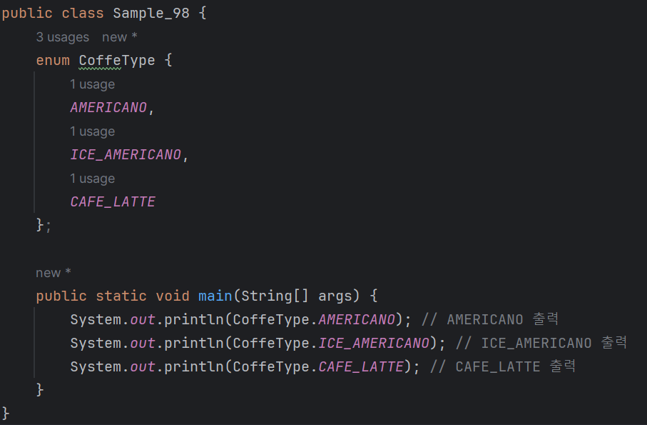
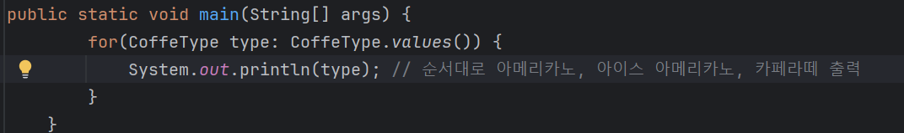

# 03-10 상수 집합
<b>enum 자료형은 서로 연관 있는 여러 개의 상수 집합을 정의할 때 사용한다.<br>
예를 들어 어느 카페에서 판매하는 커피의 종류가 다음과 같다고 가정해보자.</b><br>
<br>
* 아메리카노
* 아이스 아메리카노
* 카페라떼

3가지 커피를 판매한다면 enum으로 상수 집합을 만들 수 있다.
```
enum CoffeeType {
    AMERICANO,
    ICE_AMERICANO,
    CAFE_LATTE
};
```

| **enum** | 아메리카노 | 아이스 아메리카노 | 카페라떼 |
|----------|---|---|---|
-> enum이란 박스안에 아메리카노, 아이스 아메리카노, 카페라떼가 상수 고정값으로 들어가 있는 것

<b>이렇게 정의한 상수 집합은 다음과 같이 사용할 수 있다.</b>



<b>또는 반복문에서 사용할 수도 있다.</b>



* 이때 CoffeeType.values()는 CoffeeType의 배열을 리턴한다.

---

### enum이 필요한 이유
<b>다음 메서드를 눈으로 살펴보며, enum을 사용하면 어떤 장점이 있을지 생각해보자.</b>

```
/**
    * countSellCoffee는 판매된 커피의 개수를 리턴하는 메서드이다.
    * @param type 커피의 종류 (1: 아메리카노, 2: 아이스 아메리카노, 3: 카페라떼)
*/
int conutSellCoffee(int type) {
    (... 생략 ...)
}
```

countSellCoffee 메서드는 종류별로 판매된 커피의 개수를 리턴한다.<br.
아메리카노의 판매 개수를 알려면 다음과 같이 숫자 1을 넘겨야 한다.<br>
이 방식은 숫자 1이아메리카노라고 기억하며 사용해야해서 불편하다.
```
int americano = conutSellCoffee(1);
```
그리고 다음과 같이 사용할 때에도 문제가 발생한다.
```
int result = countSellCoffee(99); // 99라는 커피의 종류는 존재하지 않으므로 오류가 발생한다.
```
1, 2, 3이라는 인수의 값과 의미를 명확히 알고 있다면 오류는 발생하지 않겠지만 오류의 가능성은 항상 있다.

<b>그렇다면 각 커피의 번호를 기억하지 않아도 판매된 커피의 수를 알 수 있는 방법이 있는 것인가?</b>
* 이제 앞에서 사용한 메서드를 바꾸어 보자.

```
    enum CoffeType {
    AMERICANO,
    ICE_AMERICANO,
    CAFE_LATTE
    };
    
    /**
      * conutSellCoffee는 판매된 커피의 개수를 리턴하는 메서드이다.
      * @param type 커피의 종류 (CoffeeType)
    */
    
    int conutSellCoffee(CoffeeType type) {
        (... 생략 ...)   
    }
```
메서드를 이렇게 바꾸면 이 메서드를 호출할 때 숫자 대신 CoffeeType을 인수로 사용해야 한다.
```
int americano = countSellCoffee(CoffeeType.AMERICANO); // 아메리카노의 판매 개수
```
숫자 1을 사용했을 때보다 코드가 명확해진다.<br>
그리고 countSellCoffee 메서드에는 CoffeeType에 정의된 상수만 전달할 수 있기 때문에,<br>
위에서 보았던 99처럼 엉뚱한 숫자값을 입력해 생기는 오류가 발생하지 않는다.<br>
<br>
정리하면 enum은 다음과 같은 장점이 있다.
* 매직 넘버를 사용할 때보다 코드가 명확하다.
* 잘못된 값을 사용해 생길 수 있는 오류를 막을 수 있다.
  - 앞 예제의 숫자 1처럼 프로그래밍에서 상수로 선언하지 않고 사용하는 숫자를 매직 넘버라고 한다.

