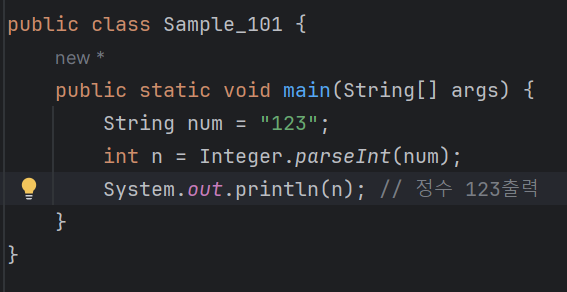
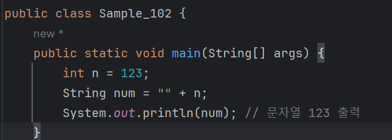
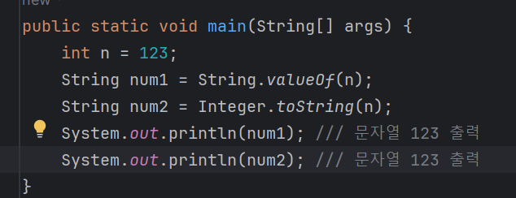
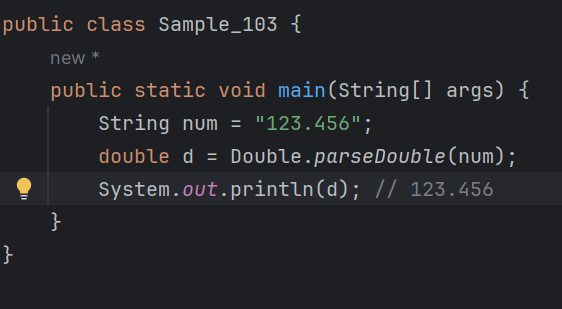
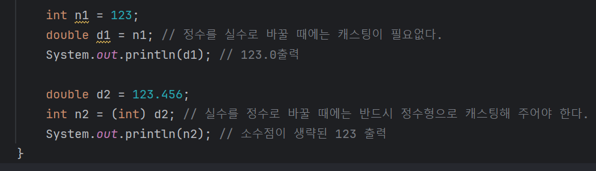
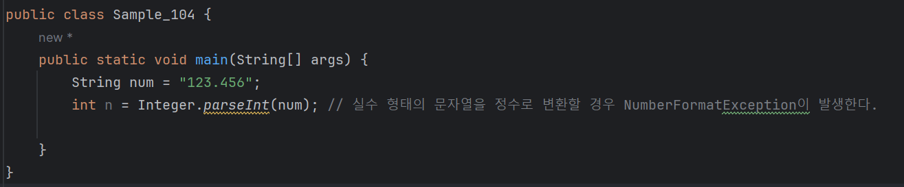
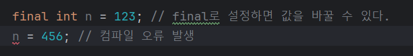
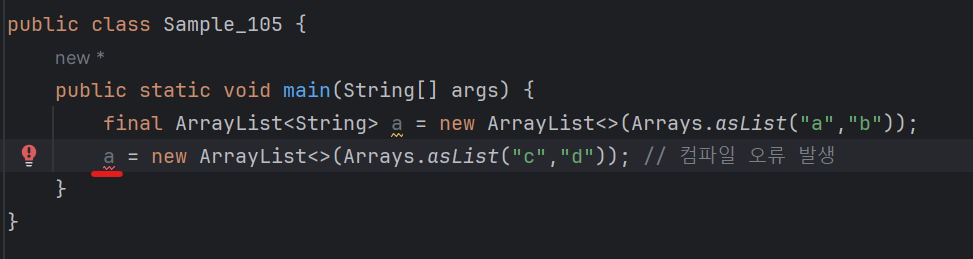

# 03-11 형 변환가 final
<b> 앞서 자바에서 사용하는 주요 자료형을 배웠다면 이제 자바의 형 변환과 final에 대해 알아보자.<br>
형 변환이란 자료형을 다른 자료형으로 바꾸는 것이다.<br>
예를 들어 "123"과 같은 문자열을 123과 같은 숫자형으로 바꾸는 것을 말한다.</b>

### 형 변환
<b>다음 문자열을 보자</b>
```
String num = "123";
```
자료형은 문자열이지만 그 내용은 숫자로 이루어진 값이다.<br>
이런 경우에 문자열을 정수로 바꿀 수 있다.<br>
문자열을 정수로 바꾸려면 Integer 클래스를 사용해야한다.



이번에는 반대로 정수 123을 문자열 "123"으로 바꿔 보자.<br>
정수를 문자열로 바꾸는 가장 쉬운 방법은 정수 앞에 빈 문자열("")을 더해 주는 것이다.



또는 다음과 같이 변환할 수 있다.



String.valueOf(정수), Integer.toString(정수) 모두 정수를 문자열로 바꾸어 리턴한다.<br>
<br>
그리고 소수점이 포함되어 있는 숫자 형태의 문자열은 같은 방법으로 Double.parseDouble이나,<br>
Float.parseFloat를 사용해 형 변환할 수 있다.



자주 사용하지는 않지만 정수와 실수 사이의 형 변환도 가능하긴 하다.



실수를 정수로 변화하면 실수의 소수점은 제거된다.<br>
int nt2 = (int) d2;에서 d2앞의 (int)는 d2의 자료형을 강제로 int형으로 바꾼다는 의미이고,<br>
이를 캐스팅이라고 한다.<br>
<br>
그리고 실수 형태의 문자열을 정수로 바꿀 때는 NumberFormatException이 발생하므로 주의해야 한다.



실수 혀애의 문자열을 숫자형으로 바꾸려면 Double.parseDouble()을 이용해 실수로 바꾼 후 사용하면 된다.

---

### final
<b>final은 자료형에 값을 단 한 번만 설정할 수 있게 강제하는 키워드이다.<br>
값을 한 번 설정하면 그 값을 다시 설정할 수 없다.


* final로 설정하면 '마지막'으로 값을 정한 것이니 더 이상 수정할 수 없다는 의미이다.
  - 그래서 이 값은 변하지 않는다.
<br>

리스트의 경우도 final로 선언하면 재할당은 불가능하다.


그러므로 final은 프로그램을 수행하면서 그 값이 바뀌면 안 될 때 사용한다.

---
### Unmodifiable List
* 리스트의 경우 final로 선언할 때 리스트에 값을 더하거나(add) 뺄(remove)수 있다.<br>
* 다만 재할당만 불가능할 뿐이다. 만약 값을 더하거나 빼는 것도 할 수 없게 하고 싶다면?<br>
  - List.of를 작성하여 수정할 수 없는 리스트로 만들면 된다.

```
public class Sample {
  public static void main(String[] args) {
    final List<String> a = List.of("a","b");
    a.add("c"); // UnsupportedOperationException 발생
    }
  }  
```

