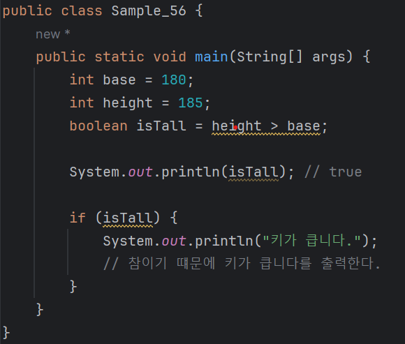
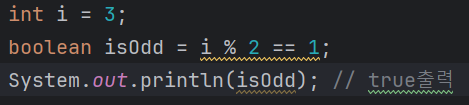

# 03-2 불(boolean)
<b>참(true) 또는 거짓(false)의 값을 갖는 자료형을 불(boolean)자료형이라고 한다.<br>
불 자료형에 대입되는 값은 참 또는 거짓만 가능하다.</b>

<b>다음은 불 변수에 값을 대입한 예제이다. 가볍게 살펴보자</b>
```
boolean isSuccess = true;
bolean isTest = false;
```
---
### 불연산
<b>불 자료형에는 불 연산의 결괏값을 대입할 수 있다.<br>
불 연산은 참 또는 거짓을 판단하는 연산을 말한다.
```
2 > 1               // 참
1 == 2              // 거짓
3 % 2 == 1          // 참(3을 2로 나눈 나머지는 1이므로 참이다.)
"3".equals("2")     // 거짓
```
<b>이러한 불 연산의 결과는 참 또는 거짓이므로 <br>
if문과 같은 조건문에 사용하거나 불 자료형에 대입할 수 있다.</b>
---
### 불 연산 사용 예 - 조건문
<b>불 연산은 보통 조건문의 판단 기준으로 많이 사용한다.</b><br>
중요)
* 프로그래밍에서 조건문은 아주 중요하다.
  - 조건문은 해당 조건이 참인 경우 코드를 실행한다.
  - 거짓일 경우 다른 코드를 싱행하거나 건너뛰는 구조이다.
  - if, else, else if, switch문이 조건문의 예들이다.



* 이 조건문은 만약 isTall에 저장된 값이 참이라면?
  - height에 저장된 값이 base에 저장된 값보다 크면 '키가 큽니다'를 출력한다.
---


* i % 2 == 1은 i를 2로 나누었을 때 나머지가 1인지를 묻는 조건문이다.
  - i는 3이므로 3을 2로 나눈 나머지는 1이되어 참이 된다.
  - 따라서 isOdd는 true값을 갖는다.