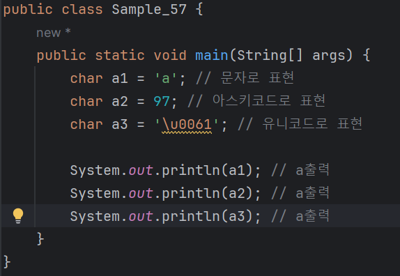

# 03-3 문자
<b> 문자 자료형은 char를 이용한다.<br>
char 자료형을사용한 예를 살펴보자.</b>

```
char a1 = 'a'; <- 문자값 앞뒤를 단일 인용 부호 ''로 감싸 주어야 한다.
```
* char 자료형은 많이 사용하는 편은 아니다.
  - 어쩌면 사용할 일이 거의 없을 정도..?
  - 하지만 문자값을 표현하는 방식은 다양하므로 사용할 때 주의해야한다.
---


* 세 종류의 코드는 a라는 문자를 똑같이 출력한다.
  - 즉, a라는 문자값을 'a', 97, '\u0061'로 사용해도 같은 결과를 나타냄
  - 첫 번째 코드는 문자로, 두 번째 코드는 아스키코드로, 세 번쨰 코드는 유니코드로 표현한 것