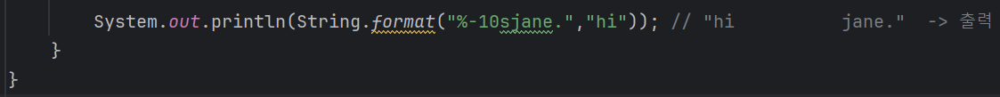

# 03-4 문자열
<b>문자열이란 다음처럼 문자로 구성된 문장을 뜻한다.</b>
```
"Happy Java"
"a"
"123"
```
<b>자바에서 문자열을 나타내는 자료형은 String이다. <br>
앞의 문자열을 자바에서 표현해 보자</b>


* 문자열의 앞과 뒤는 쌍따옴표로 감싸야 한다.

---

<b>다음과 같이 표현할 수도 있다.</b>



* 이떄 new 키워드는 객체를 만들 때 사용한다.
* 문자열을 표현할 때는 가급적이면 첫 번째 방식, "리터럴"표기 방식을 사용하자.
  - 왜냐하면 리터럴 표기 방식은 가독성이 좋고 컴파일할 때 최적화에 도움을 주기 때문

---
### 리터럴 표기 방식 이해하고 넘어가기
```
String a = "Happy Java"와 String b = new String("Happy Java")에서
a, b변수는 같은 문자열 값을 갖게 되지만 완전히 동일하지는 않다.
첫 번째 코드는 리터럴 표기 방식이라고 하는데 객체를 생성하지 않고 고정된 값을
그대로 대입하는 방법을 말한다.
이와 달리 두 번째 방식은 항상 새로운 String객체를 만든다.
```

---

### 원시 자료형
<b> 앞에서 살펴보았던 int, long, double, float, boolean, char 자료형을 원시자료형이라고 한다.<br>
이런 원시 자료형은 new 키워드로 값을 생성할 수 없다. <br>
원시 자료형은 다음 리터럴 표기 방식으로만 값을 세팅할 수 있다.</b>

```
    boolean result = true;
    char a = 'A';
    int i = 100000;
```

* 여기서 반드시 기억해 둘 게 하나 있다.
* String은 리터럴 표기 방식을 사용할 수 있지만 원시 자료형에 포함되지 않는다.
  - String은 리터럴 표기 방식을 사용할 수 있도록 자바에서 특별 대우해 주는 자료형이다.
---

### Wrapper 클래스
<b>int, long, double, float, boolean, char등의 원시 자료형에는 각각 그에 대응하는 Wrapper클래스가 있다.<br>
Wrapper 클래스는 원시 자료형을 대신하여 사용할 수 있는 자료형으로, 객체지향 프로그래밍의 모든 기능을 활요할 수 있게 해준다.

