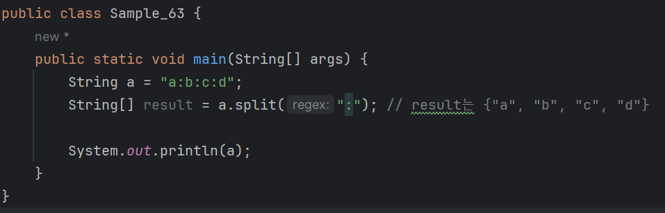
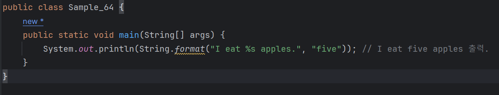
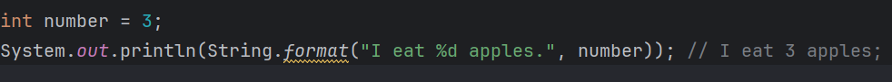
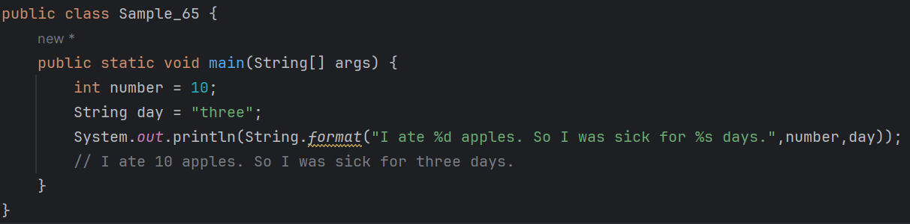

# 03-4 문자열
<b>문자열이란 다음처럼 문자로 구성된 문장을 뜻한다.</b>
```
"Happy Java"
"a"
"123"
```
<b>자바에서 문자열을 나타내는 자료형은 String이다. <br>
앞의 문자열을 자바에서 표현해 보자</b>


* 문자열의 앞과 뒤는 쌍따옴표로 감싸야 한다.

---

<b>다음과 같이 표현할 수도 있다.</b>


* 이떄 new 키워드는 객체를 만들 때 사용한다.
* 문자열을 표현할 때는 가급적이면 첫 번째 방식, "리터럴"표기 방식을 사용하자.
  - 왜냐하면 리터럴 표기 방식은 가독성이 좋고 컴파일할 때 최적화에 도움을 주기 때문

---
### 리터럴 표기 방식 이해하고 넘어가기
```
String a = "Happy Java"와 String b = new String("Happy Java")에서
a, b변수는 같은 문자열 값을 갖게 되지만 완전히 동일하지는 않다.
첫 번째 코드는 리터럴 표기 방식이라고 하는데 객체를 생성하지 않고 고정된 값을
그대로 대입하는 방법을 말한다.
이와 달리 두 번째 방식은 항상 새로운 String객체를 만든다.
```

---

### 원시 자료형
<b> 앞에서 살펴보았던 int, long, double, float, boolean, char 자료형을 원시자료형이라고 한다.<br>
이런 원시 자료형은 new 키워드로 값을 생성할 수 없다. <br>
원시 자료형은 다음 리터럴 표기 방식으로만 값을 세팅할 수 있다.</b>

```
    boolean result = true;
    char a = 'A';
    int i = 100000;
```

* 여기서 반드시 기억해 둘 게 하나 있다.
* String은 리터럴 표기 방식을 사용할 수 있지만 원시 자료형에 포함되지 않는다.
  - String은 리터럴 표기 방식을 사용할 수 있도록 자바에서 특별 대우해 주는 자료형이다.
---

### Wrapper 클래스
<b>int, long, double, float, boolean, char등의 원시 자료형에는 각각 그에 대응하는 Wrapper클래스가 있다.<br>
Wrapper 클래스는 원시 자료형을 대신하여 사용할 수 있는 자료형으로, 객체지향 프로그래밍의 모든 기능을 활요할 수 있게 해준다.</b>

| 원시 자료형  | Wrapper 클래스 |
|---------|-------------|
| int     | Integer     |
| long    | Long        |
| double  | Double      |
| float   | Float       |
| boolean | Boolean     |
| char    | Char        |

* 앞으로 공부할 ArrayList, HashMap, HashSet 등은 데이터를 생성할 떄, <br>
원시 자료형 대신 그에 대응하는 Wrapper 클래스를 사용해야 한다.
* 이렇게 하면 값 대신 객체를 주고받을 수 있어서 코드를 객체 중심으로 작성하는 데 유리하다.
* 또한 멀티 스레드 환경에서 동기화를 지원하기 위해서도 Wrapper 클래스는 반드시 필요하다.

---

### 문자열 내장 메서드
<b>String 자료형의 내장 메서드 중에서 자주 사용하는 것을 알아보자.<br>
String 자료형의 내장 메서드는 문자열 객체에 속한 함수라 할 수 있다.<br>
문자열 합치기, 분할, 대소문자 변환 등의 문자열을 다양하게 활용할 수 있도록 도와주는 역할을 한다.</b>

### equals
<b> equals 메서드는 문자열 2개가 같은지를 비교하여 결과값을 리턴한다. </b><br>

#### 참고) 

* '리턴한다'라는 것은 메서드에서 값을 반환하는 작업을 한다는 뜻이다.
* 메서드는 특정 작업을 수행한 후 결과를 호출한 곳으로 돌려주기 위해 리턴한다.


* 문자열 a와 문자열 b에는 hello와 java가 각각 저장되어 있으므로 값이 서로 같지 않다. 
  - 따라서 equals 메서드를 호출하면 false를 리턴한다.
  - 그러나 문자열 a와 문자열 c는 hello와 hello로 값이 서로 같으므로 true를 리턴한다.
* 이처럼 문자열의 값을 비교할 때는 반드시 equals를 사용해야 한다.
  - 만약 equals 대신 == 연산자를 사용한다면 다음과 같은 결과가 발생한다.



* 문자열 a와 b는 모두 hello로 값이 같지만 equals를 호출하면 true를, == 연산자를 사용하면 false를 리턴한다
* a와 b는 값은 같지만 서로 다른 객체이기 때문이다.
* ==은 2개의 자료형이 같은 객체인지를 판별할 때 사용하는 연산자이므로 false를 리턴한다.

---

### indexOf
<b> indexOf는 문자열에서 특정 문자열이 시작되는 위치(인덱스값)를 리턴한다.<br>
문자열 a에서 Java가 시작되는 위치를 알고 싶다면 IndexOf를 사용하여 다음처럼 위치를 리턴받을 수 있다.</b>


* 문자열 Hello Java에서 특정 문자열인 Java는 일곱 번째 문자인 J부터 시작한다.
  - 이때 결과값이 7이 아닌 6으로 나오는 이유는?
  - <b>자바에서는 숫자를 0부터 세기 떄문이다.</b>

---

### contains
<b> contains 메서드는 문자열에서 특정 문자열이 포함되어 있는지 여부를 리턴한다.</b>


* 문자열 a는 Java라는 문자열을 포함하고 있어서 true를 리턴한다.

---

### charAt
<b>charAt 메서드는 문자열에서 특정 위치의 문자를 리턴한다.<br>
Hello Java 문자열에서 J는 여섯번째 인덱스에 위치한 문자이다.<br>
인덱스6으로 문자 J를 리턴받으려면 다음과 같이 charAt을 사용한다.</b>


---

### replaceAll
<b>replaceAll 메서드는 문자열에서 특정 문자열을 다른 문자열로 바꿀 때 사용한다.<br>
다음 예에서는 Hello Java 문자열에서 Java를 World로 바꾸었다.


---

### substring
<b>substring 메서드는 문자열에서 특정 문자열을 뽑아낼 때 사용한다.


* 위처럼 substring(시작 위치, 끝 위치)와 같이 코드를 작성하면<br>
문자열의 시작 위치에서 끝 위치까지의 문자를 뽑아내게 된다.
  - 단, 끝 위치의 문자는 포함이 안된다는 점에 주의하자.
  - 이것은 다음과 같은 수학의 식과 비슷하다.
```
시작 위치 ≤ a < 끝 위치
```

---
### toUpperCase
<b>toUpperCase 메서드는 문자열을 모두 대문자로 변경할 때 사용한다.</b>


문자열을 모두소문자로 변경할 때는 toLowerCase를 사용한다.

---

### split
<b>split 메서드는 문자열을 특정한 구분자로 나누어 문자열 배열로 리턴한다.</b>


* 이번 예처럼 a:b:c:d라는 문자열을 :(콜론)으로 나누어 {"a","b","c","d"} 문자열 배열을 만들 수 있다.

---

### 문자열 포매팅
<b>문자열에서 또 하나 알아야 할 것으로 문자열 포매팅이 있다.<br>
먼저, 다음 문자열을 출력하는 프로그램을 작성했다고 가정해 보자.</b>
```
"현재 온도는 18도입니다."
```
-> 시간이 지나서 20도가 되면 다음 문자열을 출력한다.
```
"현재 온도는 20도입니다."
```
* 위 두 문자열은 각각 18과 20이라는 숫자만 다를 뿐 형식은 같다.
* 이렇게 문자열 안의 특정한 값을 바꿀 수 있게 해주는 것이 바로 문자열 포매팅 기법이다.
* 문자열 포매팅이란 쉽게 말해 문자열 안에 어떤 값을 삽입하는 방법이다.
* 다음 예를 직접 실행해 보면서 문자열 포매팅 기법을 알아보자

### 숫자 바로 대입하기
<b> 문자열 포매팅은 String.format 메서드를 사용한다.</b>


<b>이 예제의 결과값을 보면 알겠지만, 문자열 안에 정수 3을 삽입하는 방법을 보여준다.<br>
문자열안에서 숫자를 넣고 싶은 자리에 %d를 입력하고, 삽입할 숫자 3을 두 번쨰 파라미터로 전달했다.<br>
%d는 문자열 포맷 코드라고 한다.<br>
문자열 포맷 코드는 잠시 뒤에 더 자세히 다루자. 여기서는 이런 것이 있다는 것만 알자.</b>

---

### 문자열 바로 대입하기
<b>문자열 안에 꼭 숫자만 넣으라는 법은 없다. 이번에는 숫자 대신 문자열을 넣어 보자.</b>


<b>이 예제에서는 문자열 안에 또 다른 문자열을 삽입하기 위해 앞에서 사용한 문자열 포맷 코드 %d가 아니라 %s를 썼다.<br>
숫자를 넣기 위해서는 %d를, 문자열을 넣으려면 %s를 써야 한다.</b>

---
### 숫자값을 나타내는 변수 대입하기
#### 다음 예를 살펴보자


<b>숫자를 바로 대입하는 방법과 결과는 같지만, 이 예제는 숫자값을 나타내는 변수를 대입한다.</b>

---

### 값을 2개 이상 넣기
<b>그렇다면 문자열 안에 값을 여러 개 넣으려면 어떻게 하는지 알아보자.<br>
다음처럼 값을 2개 이상 넣으려면 파라미터를 순서대로 전달하면 된다.</b>


---

## 문자열 포맷 코드
<b>문자열 포맷 코드의 종류</b>
지금까지 문자열 포매팅 예제에서는 대입해 넣는 자료형으로 정수와 문자열을 사용했는데 이 외에도 다양한 종류가 있다.<br>
문자열 포맷 코드의 종류를 알아보자.

| 종류 | 설명 |
| --- | --- |
| %s | 문자열(String)|
| %c | 문자 1개(character)|
| %d | 정수(Integer) |
| %f | 부동 소수(floating-point) |
| %o | 8진수 |
| %x | 16진수 |
| %% | 특수 문자 % |

참고)
* %s -> 이 포맷 코드는 어떤 형태의 값이든 변환해 넣을 수 있다. 


