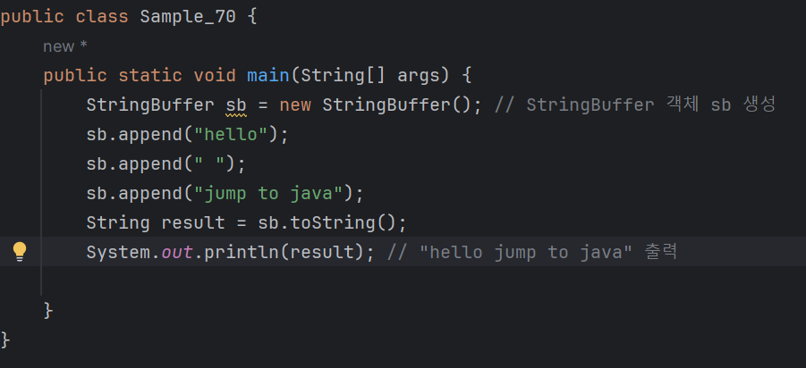
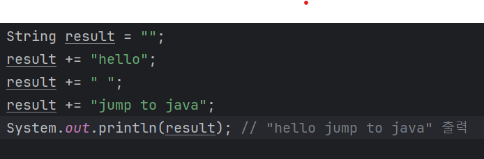
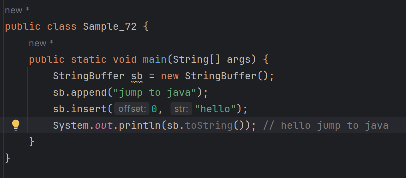
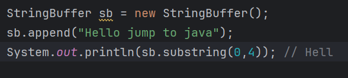

### 03-5 StringBuffer
<b>StringBuffer는 문자열을 추가하거나 변경할 때 주로 사용하는 자료형이다.<br>
StringBuffer의 다양한 메서드를 살펴보면서 StringBuffer의 사용법을 알아보자.

### append
<b>다음은 StringBuffer 객체를 생성하고 문자열을 생성하는 예제이다.</b>



<b>StringBuffer 자료형은 append 메서드를 사용하여 문자열을 계속해서 추가해 나갈 수 있다.<br>
그리고 toString() 메서드를 사용하면 StringBuffer를 String 자료형으로 변경할 수도 있다.</b>

이 예제를 StringBuufer 대신 String 자료형을 사용하도록 변경해보자.



설명)
두 번째 예제와 첫 번째 예제의 결과는 같지만 내부적으로 객체를 생성하고 메모리를 사용하는 과정은 다르다.<br>
첫 번째 예제에서는 StringBuffer 객체를 한 번만 생성하지만,<br>
두 번째 예제에서는 String 자료형에 + 연산이 있을 때마다 새로운 String 갹체를 생성하므로<br>
총 4개의 String 자료형 객체가 만들어진다.<br>
<br>
String 자료형은 값이 한 번 생성되면 변경할 수가 없다.<br>
toUpperCase와 같은 메서드를 보면 문자열이 변경되는 것처럼 생각할 수도 있지만, <br>
해당 메서드를 수행할 때 또 다른 String 객체를 생성하여 리턴할 뿐이다.<br>
반면에 StringBuffer 자료형은 값을 변경할 수 있으므로 생성된 값을 언제든지 수정할 수 있다.<br>
<br>
그렇다면 무조건 StringBuffer를 사용하는 것이 좋은 것인가? -> 상황에 따라 다르다.<br>
StringBuffer 자료형은 String 자료형보다 무거운 편에 속한다.<br>
new StringBuufer()로 객체를 생성하면 String을 사용할 때보다 메모리 사용량도 많고 속도도 느리다.<br>
따라서 문자열을 추가하거나 변경하는 작업이 많으면 StringBuffer를, <br>
적으면 String을 사용하는것이 유리하다.

---

### StringBuilder 알아보기
<b>StringBuilder는 StringBuffer와 비슷한 자료형으로 사용법도 같다.</b>

```
StringBuliler sb = new StringBuilder();
sb.append("hello");
sb.append(" ");
sb.append("jump to java");
String result = sb.toString();
System.out.println(result);
```

* StringBuffer는 멀티 스레드 환경에서 안전하다.
  - StringBuilder는 SringBuffer보다 성능이 우수하다는 장점이 있다.
  - 동기화를 고려할 필요가 없는 상황에서는 StringBuffer보다 StringBuilder를 사용하는것이 유리하다.

---

### insert
<b>insert 메서드는 특정 위치에 원하는 문자열을 삽입할 수 있다.<br>
insert를 사용하여 0번째 위치에 hello라는 문자열을 삽입해보자</b>



---

## subString
<b>subString 메서드는 String 자료형의 substring 메서드와 동일하게 동작한다.<br>
다음과 같이 subtring(시작 위치, 끝 위치)와 같이 사용하면 StringBuffer객체의 시작 위치에서<br>
끝 위치까지의 문자를 뽑아낸다</b>




