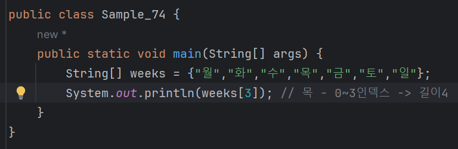
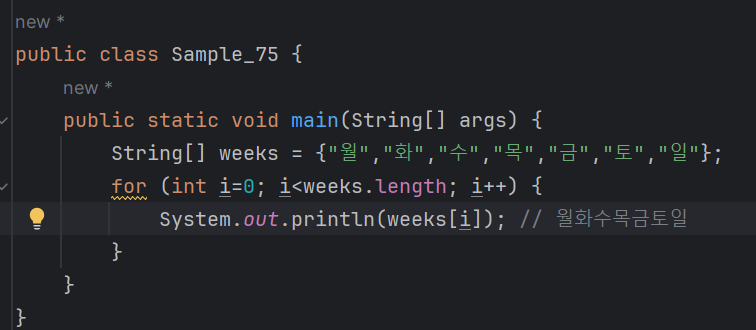

# 03-6 배열
<b>지금까지 숫자와 문자, 문자열 등 다양한 자료형을 알아보았다.<br>
하지만 이것만으로 프로그래밍을 하기에는 부족한 점이 많다.<br>
예를 들어 1부터 10까지의 숫자 중 홀수만 모은 1,3,5,7,9라는 집합을 생각해보자<br>
이런 집합을 숫자나 문자열만으로 표기하기는 쉽지 않다.<br>
이럴 때 [배열]을 사용한다. 배열은 자료형 바로 옆에 [] 기호를 붙인다.<br>
<br>
1부터 10까지의 숫자 중 홀수의 집합은 다음과 같이 int배열로 표현할 수 있다. <br>
int자료형의 배열은 int[]로 표현한다.

```
int[] doos = {1,3,5,7,9};
```
String 배열로 요일의 집합을 표현할 수도 있다.
```
String[] weeks = {"월","화","수","목","금","토","일"};
```
즉, 배열이란 자료형의 종류가 아니라 자료형의 집합을 의미한다.

참고)<br>
앞의 두 배열은 1차원 배열이다.<br>
2차원, 3차원 등의 다차원 배열도 가능하지만 2차원 이상의 배열은 잘 사용하지 않는다.

---

### 배열의 길이 설정하기
앞서 살펴본 요일의 집합 예제를 다음처럼 수정할 수 있다.<br>
배열의 길이를 먼저 설정한 뒤, 배열 변수를 생성하고 그 값을 나중에 대입하는 방법이다.

```
String[] weeks = new String[7];
weeks[0] = "월";
weeks[1] = "화";
weeks[2] = "수";
weeks[3] = "목";
weeks[4] = "금";
weeks[5] = "토";
weeks[6] = "일";
```
<br>

| 월 | 화 | 수 | 목 | 금 | 토 | 일 |
| --- |---| --- | --- | --- | --- | --- |
|0| 1 |2|3|4|5|6|
* 인덱스 0~6
* 배열의 길이는 7

단, 초기값 없이 배열 변수를 만들 때에는 7과 같은 숫자값을 넣어 길이를 정해 줘야 한다.<br>
그렇지 않으면 오류가 발생함
```
String[] weeks = new String[]; // 길이에 대한 숫자값이 없어서 컴파일 오류가 발생
```

---

### 배열값에 접근하기
<b>앞서 만든 요일의 배열에서 '목'요일에 해당하는 값을 얻으려면 인덱스를 이용해야 한다.

* weeks[3]은 weeks 배열의 네 번째 항목을 의미한다.

---

### 배열의 길이 구하기
<b>배열은 보통 for문과 함께 사용한다.<br>
for문에 배열을 사용할 때에는 배열의 길이를 알아야 한다.<br>
왜냐하면 배열의 길이만큼 for문을 반복하기 때문.<br>
이때 배열의 길이는 length를 사용하면 된다.</b>



weeks 배열을 순서대로 출력하는 프로그램이다.<br>
weeks 배열에는 7개의 요소가 있으므로 weeks.length는 7이다.<br>
여기서는 for문보다 length를 어떻게 사용했는지 눈여겨보기.

---

### 배열 오류
<b>다음은 자바 코드를 작성하면서 사장 많이 보는 오류 중 하나이다.</b>
```
ArrayIndexOutOfBoundsException
```
요일의 배열 길이는 7인데 여덟 번째 값을 얻으려고 하면 이런 오류가 발생한다.
```
System.out.println(weeks[7]); // 여덟 번째 배열값이 없으므로 ArrayIndexOutOfBoundsException 오류 발생
```
