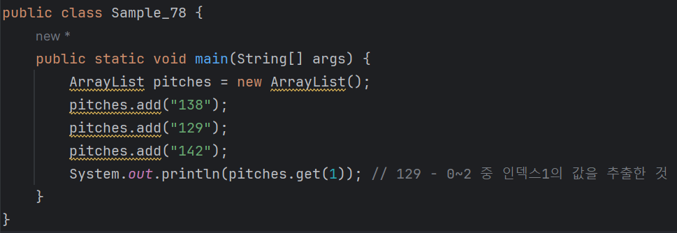
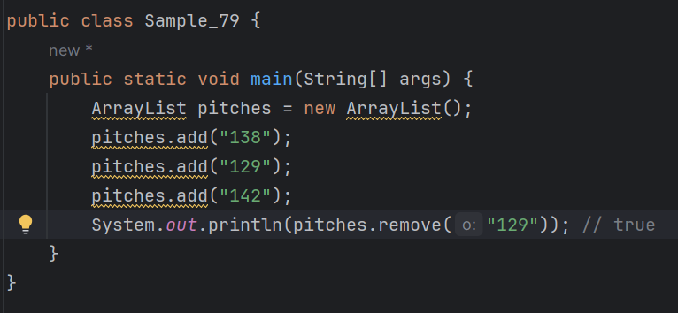

# 03-7 리스트

<b>리스트는 배열과 비슷하지만 편리한 기능이 더 많은 자료형이다.<br>
리스트와 배열의 가장 큰 차이점은, 배열은 크기가 정해져 있지만 리스트는 변한다는 데 있다.<br>
예를 들어 배열의 크기를 10개로 정했다면 10개를 초과하는 값을 담을 수는 없다.<br>
하지만 리스트는 크기가 정해져 있지 않아 원하는 만큼 값을 담을 수 있다.</b>

List라는 박스안에 자료나 값이 담기는것이고, 많아질수록 List는 점점 커지는것이다.

<b>
야구 선수의 투구 속도를 저장해야 한다고 가정해 보자.<br>
이때 배열을 이용하면 되는 것인가? -> 그런데 야구 경기의 한 회 동안 야구 선수의 투구 수는 3개도 될 수 있고 100개가 넘을 수도 있다.<br>
이처럼 프로그래밍을 할 때에는 저장할 값의 크기를 알 수 있는 경우도 있지만 명확하지 않을 때도 있다.<br>
그러므로 자료형의 개수가 계속 변하는 상황이라면 리스트를 사용해야 한다.
</b>

---

## ArrayList
<b>리스트 자료형에서 가장 일반적으로 사용하는 ArrayList를 알아보자.<br>
참고로 리스트 자료형에는 ArrayList, Vector, LinkedList 등이 있다.</b>

### add
<b>ArrayList의 add 메서드를 사용하면 요소값을 추가할 수 있다.<br>
야구 선수가 공을 총 3번 던졌는데 각각 시속 138, 129, 142(km/h)였다면 다음과 같이 코드를 작성할 수 있다.


참고)<br>
ArrayList를 사용하려면 import java.util.ArrayList와 같은 import 문을 작성해야 한다.<br>
이때 import 문은 다른 패키지나 클래스를 현재 코드에서 사용하기 위해 선언하는 문장이다.<br>
그리고 Java.util 패키지는 자바가 기본적으로 제공하는패키지이다.<br>
<br>
ArrayList의 객체인 pitches에 add 메서드를 이용해 투구 속도를 저장했다.<br>
만약 첫 번쨰 위치에 133이라는 투구 속도를 추가하고 싶다면 다음과 삽입할 위치를 파라미터로 넘겨 주어야 한다.
```
pitches.add(0, "133"); // 첫 번째 위치에 133 삽입
```
또는 두 번쨰 위치에 133을 삽입하고 싶다면 다음과 같이 입력하자.
```
pitches.add(1, "133"); // 두 번째 위치에 133 삽입
```

참고)<br>
자바 J2SE 5.0 버전부터 객체를 포함하는 자료형은 어떤 객체를 포함하는지,<br>
ArrayList<String> pitches = new ArrayList<>();처럼 명확하게 표현할 것을 권고하고 있다.<br>

---

### get
<b>ArrayList의 get 메서드를 사용하면 특정 인덱스의 값을 추출할 수 있다.<br>
앞의 예제에서 야구선수의 두 번째 투구 속도를 출력하고 싶다면 다음과 같이 코드를 작성해야 한다.</b>



---
### size
<b>size 메소드는 ArrayList의 요소의 개수를 리턴한다.<br>
다음 코드를 실행하면 pitches에 담긴 요소의 개수가 출력된다</b>


---
### contains
<b>contains 메서드는 리스트 안에 해당 항목이 있는지 판별해 그 결과를 boolean으로 리턴한다.<br>
pitches 객체는142를 포함하고 있으므로 true가 출력된다.</b>


---
# remove
<b>remove 메서드에는 2가지 방식이 있다.
* remove(객체)
* remove(인덱스)

첫 번째 방식인 remove(객체)를 사용하면 리스트에서 객체에 해당하는 항목을 삭제한 뒤, 그 결과로 true 또는 false를 리턴한다.



두 번째 방식인 remove(인덱스)를 사용하면 인덱스에 해당하는 항목을 삭제한 뒤, 그 항목을 리턴한다


---

### 제네릭스
<b>제네릭스는 자바 J2SE 5.0 버전 이후에 도입된 개념으로, 자료형을 안전하게 사용할 수 있도록 만들어주는 기능이다.<br>
제네릭스를 사용하면 자료형을 강제로 바꿀 때 생길 수 있는 캐스팅 오류를 줄일 수 있다.</b>
<br>

제네릭스의 예)

```
| 일반적인 방식 | ArrayList<String> pitches = new ArrayList<String>(); 
| 선호되는 방식 | ArrayList<String> pitches = new ArrayList<>(); 
```
* 뒤에 있는 <> 이 부분의 자료형은 명확하므로 굳이 적지 않아도 된다.

<b>제네릭스가 도입되기 전 (~J2SE 1.4)까지는 다음과 같이 사용했다.
```
ArrayList pitches = new ArrayList();
```
* 제네릭스 도입 전후의 차이는 ArrayList자료형 다음에 <String>이 있는가 없는가에 이다.
  - 제네릭스를 표현한 <String>은 'ArrayList에 담을 수 있는 자료형은 String뿐이다'라는 뜻이다.
  - 즉, 제네릭스를 이용하면 자료형을 좀 더 명확하게 체크할 수 있다는 장점이 있다.

<b>제네릭스의 이점을 조금 더 살펴보자. 다음은 제네릭스를 사용하지 않은 예이다.


* 제네릭스를 사용하지 않으면 ArrayList에 추가하는 객체는 Object 자료형으로 인식된다.
  - Object 자료형은 모든 객체가 상속하고 있는 가장 기본적인 자료형이다.
  - 따라서 ArrayList 객체인 pitches에 값을 넣을 때는 문제가 없지만,
    - 값을 가져올 때는 매번 Object 자료형에서 String 자료형으로 형변환을 해야한다.

```
String one = (String) pitches.get(0); // Object 자료형을 String 자료형으로 형 변환
```
이때 주의할 점은 pitches에는 String외의 다른 객체도 넣을 수 있어서 형 변환 오류가 발생할 수 있다는 점이다.<br>
<br>
앞의 코드에 제네릭스를 적용해보기.


* 제네릭스로 자료형을 선언만 하면 그 이후로는 형 변환하는 과정이 필요없다.
* pitches에는 반드시 String 자료형만 추가되어야 한다는 것을 컴파일러가 이미 알기 때문이다.
* 이처럼 제네릭스를 이용하면 형 변환과 관련된 불필요한 코딩을 줄일 수 있고,
  - 잘못된 형 변환 때문에 발생하는 런타임 오류를 방지할 수 있다.

---
### 다양한 방법으로 ArrayList 만들기
<b>ArrayList의 add 메서드를 사용하면 ArayList 객체에 요소를 추가할 수 있다.</b>


* 하지만 이미 문자열 배열이 있으면 ArrayList를 좀 더 편하게 생성할 수 있다.


* 이처럼 java.util.Arrays 클래스의 aslist메서드를 사용하면 이미 존재하는 문자열 배열로 ArrayList를 만들 수 있다.
  - 또는 String 배열 대신 String 자료형을 여러 개 전달하여 생성할 수도 있다.


---

### String.join
<b>앞에서 138,129,142 세 요소로 이루어진 ArrayList를 만들었다.<br>
그렇다면 ArrayList의 각 요소를 콤마(,)로 구분해서 1개의 문자열로 만들 수 있는가?</b>

* 콤마를 각 요소 중간에 넣으려면 이렇게 작성해야 한다.


* pitches를 요소 개수마늠 루프를 돌면서 뒤에 콤마를 더한 뒤, 마지막 콤마를 제거하는 방법이다.
  - 이처럼 리스트의 각요소에 구분자를 끼워 넣어 1개의 문자열을 만드는 것은 꽤 까다롭다.
  - 이때 String.join을 사용하면 더 간단하게 처리할 수 있다. 다음 예를 살펴보자.


* String.join("구분자",리스트 객체)를 같이 사용해 리스트의 각 요소에 구분자를 넣어 하나의 문자열로 만들 수 있다.<br>
String.join은 문자열 배열에도 사용할 수 있다.


---

### 리스트 정렬하기
<b>이번에는 138,129,142 세 요소로 이루어진 ArrayList를 순서대로 정렬해 보자.<br>
순서대로 정렬하기 위해서는 리스트의 sort 메서드를 사용해야 한다.


<b>sort 메서드에는 정렬 기준을 파라미터로 전달행 한다.<br>
정렬 기준에는 오름차순, 내림차순이 있다.</b>
* 오름차순(순방향) 정렬 : Comparator.naturalOrder()
* 내림차순(역박향) 정렬 : Comparator.reverseOrder()

sort 메서드로 정렬하고 pitches를 출력하면 [129,138,142] 처럼 오름차순으로 정렬되어 출력되는 것을 확인할 수 있다.

참고)<br>
* 배열보다는 리스트가 좀 더 편리하게 사용될거라고 예상
  - 꼼꼼히 잘 익혀두기


