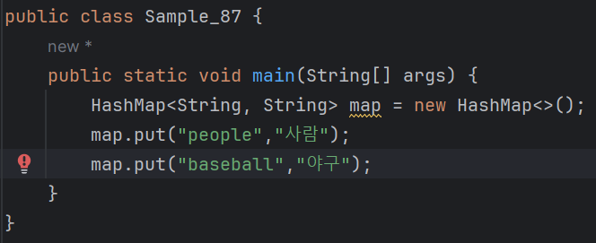
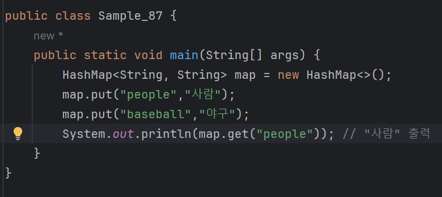
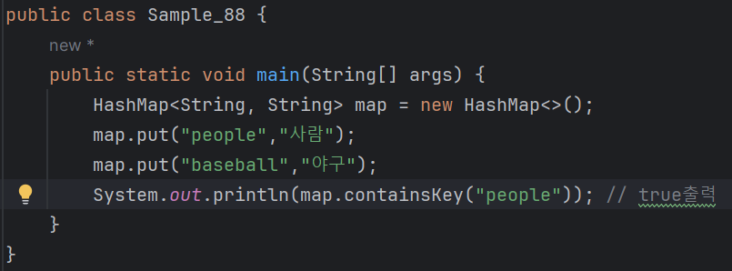
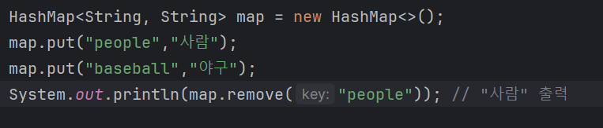
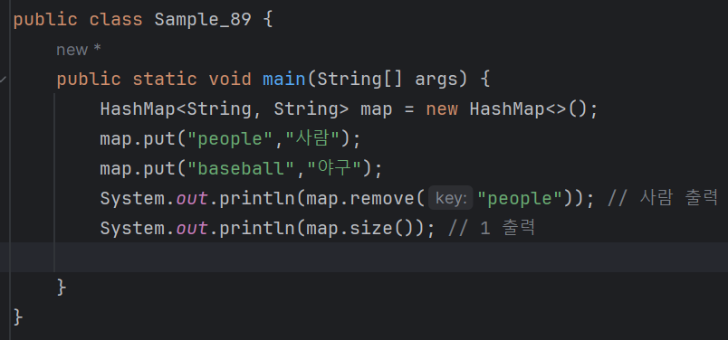
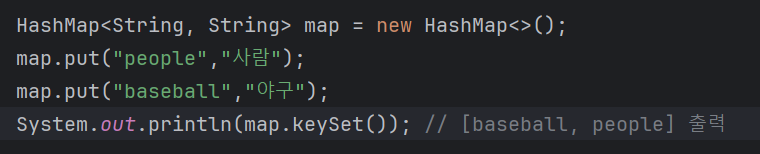

# 03-8 맵
<b>사람을 '이름 = 홍길동', '생일 = 몇 월 며칠'등으로 구분할 수 있듯이,<br>
맵은 대응 관계를 쉽게 표현할 수 있게 해주는 자료형이다.
<br>
<br>
맵은 사전과 비슷하다. 예를 들어 people이란 단어에는 사람,<br>
baseball이라는 단어에는 야구라는 뜻이 부합되듯이 맵은 키(key)와 값(value)을 한 쌍으로 갖는 자료형이다.

| 키(key) | 값(value) |
|---|---|
|people|사람|
|baseball|야구|

* 맵은 리스트나 배열처럼 순차적으로 요소값을 구하지 않고 키(key)를 이용해 값(value)을 얻는다.
* 우리가 baseball이란 단어의 뜻을 찾을 때 사전의 1쪽부터 모두 읽지 않고 baseball이라는 단어가 있는 곳을 찾아 확인하는 거과 같다.
* 맵 자료형에는 HashMap, LinkedHashMap, TreeMap 등이 있다.

---

### HashMap
<b>맵 자료형 중 가장 기본인 HashMap에 대해 알아보자.</b>

### put
put 메서드는 key와 value를 추가할 수 있다.<br>
key와 value가 String인 HashMap을 만들고 앞의 표에서 봤던 항목을 입력해보자.



<b> - - > HashMap 역시 제네릭스를 이용한다.<br>
HashMap의 제네릭스는 key, value 모두 String 자료형이다.<br>
따라서 key, value에 String 이외의 자료형은 사용할 수 없다.</b>

---

### get
<b>get 메서드는 key에 해당하는 value를 얻을 때 사용한다.</b>


<b> 위 예제를 실행하면 map 객체의 key인 people가 대응하는 value인 사람이 출력된다.
* key - people
* value - 사람

---

### getOrDefault 알아보기
<b>맵의 key에 해당하는 value가 없을 때 get 메서드를 사용하면 null이 리턴된다.</b>
```
System.out.println(map.get("java"));
- > null
```
null 대신 기본값을 얻고 싶다면 getOrDefault 메서드를 사용하면 된다.
```
System.out.println(map.getOrDefault("java","자바"));
- > 자바 
```

---

### containsKey
<b>containsKey 메서드는 맵에 해당 key가 있는지를 참 또는 거짓으로 리턴한다.</b>



<b>- > 이 예제에서 perple이라는 key 존재하므로 true가 출력되는 것이다.</b>

---

### remove
<b>remove 메서드는 맵의 항목을 삭제하는 메서드로, 해당 key의 항목을 삭제한 후 value 값을 리턴한다.</b>



<b>- > people에 해당되는 key와 value가 모두 삭제된 후 사람이 출력된다.</b>

---

### size
<b>size 메서드는 맵 요소의 개수를 리턴한다.</b>



<b>- > people, baseball 두 개를 가지고 있다가 epople이 삭제되어 1을 출력한다.</b>

---

### keySet
<b>keySet은 맵의 모든 key를 모아서 리턴한다.</b>



<b>- > keySet() 메서드는 맵의 모든 key를 모아서 집합 자료형으로 리턴한다. <br>
집합 자료형은 리스트 자료형으로 바꾸어 사용할 수도 있다.</b>
```
List<String> keyList = new ArrayList<>(map.keySet());
```

---

#### 참고) LinkedHashMap과 TreeMap
맵의 가장 큰 특징은 순서에 의존하지않고 key로 value를 가져오는 것이다.<br>
그런데 가끔 Map에 입력된 순서대로 데이터를 가져오거나 입력한 key에 의해 정렬하도록 저장하고 싶을 수 있다. <br>
이럴 때는 LinkedHashMap과 TreeMap을 사용하면 된다.<br>
* LinkedHashMap : 입력된 순서대로 데이터를 저장한다.
* TreeMap : 입렬된 key의 오름차순으로 데이터를 저장한다.

---

#### 참고) 언뜻 리스트와 맵이 비슷해 보이지만 큰 차이가 있다.
* 리스트는 순서가 중요하지만 맵은 순서에 의존하지 않는다.
* 프로그래밍의 목적에 따라 개발자가 잘 선택해서 사용하면 된다.


