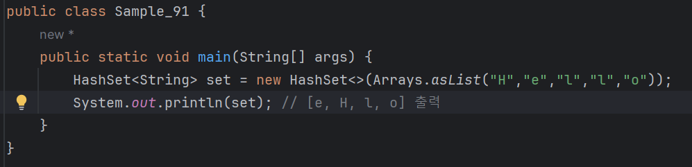
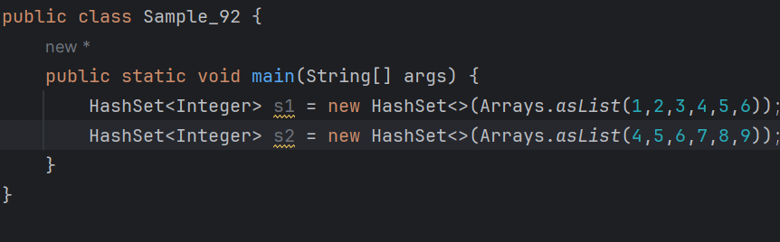
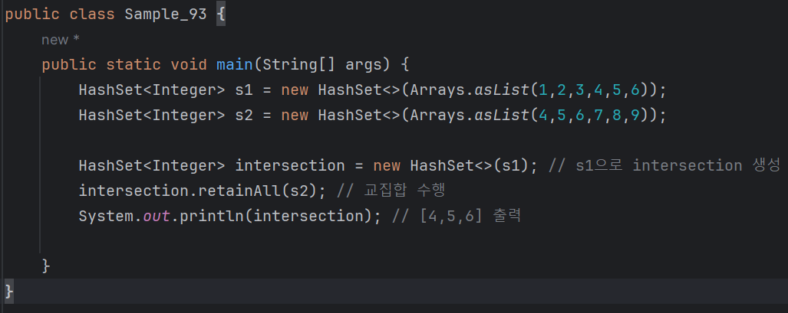
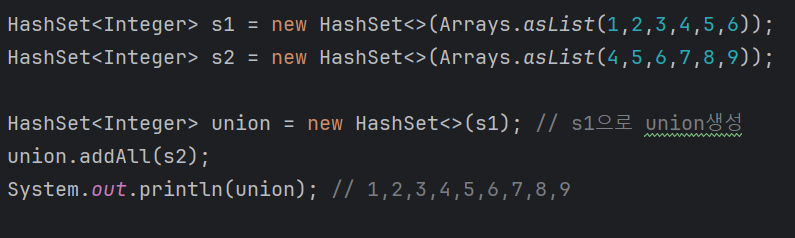
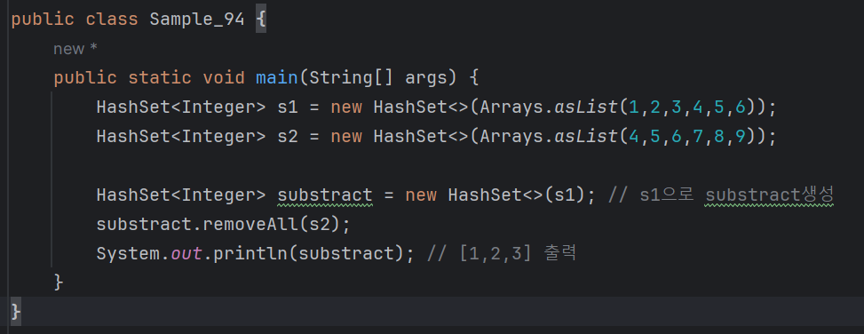
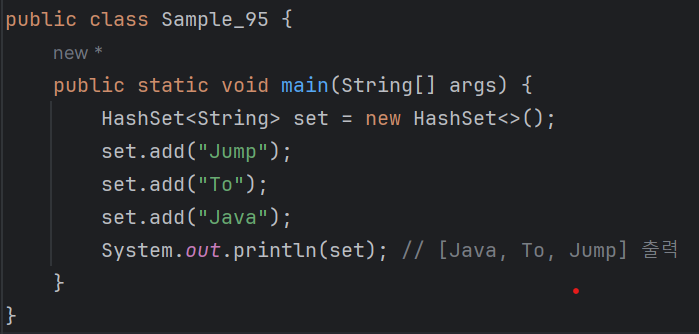
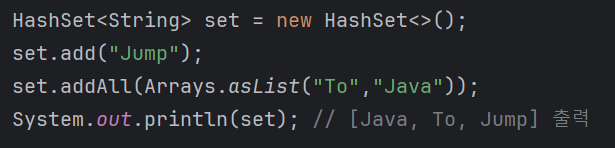
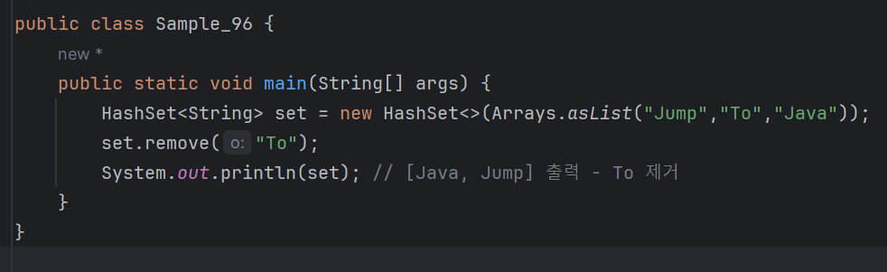

# 03-9 집합
<b>집합 자료형은 집합과 관련된 것을 쉽게 처리하기 위해 만든 것으로 HashSet, TreeSet, LinkedHashSet 등이 있다. 
이 중에서 가장 많이 사용하는 HashSet에 대해 알아 보자.</b>

### 집합 자료형의 2가지 특징
<b>앞서 살펴본 출력 결과에 이상한 점이 많다. 
분명 H,e,l,l,o 라는 문자열 배열로 HashSet 자료형을 만들었는데 출력된 자료형에는 l 문자가 빠져 있고 순서도 뒤죽박죽이다. 
그 이유는 집합 자료형에는 2가지 큰 특징이 있기 때문이다.</b>
* 중복을 허용하지 않는다.
* 순서가 없다.

리스트나 배열은 순서가 있기 때문에 인덱싱을 통해 자료형의 값을 얻을 수 있지만, 
자료형은 순서가 없기 때문에 인덱싱으로 값을 얻을 수 없다. 
이는 마치 맵 자료형과 비슷하다. 맵 자료형 역시 순서가 없는 자료형이라 인덱싱을 지원하지 않는다.

### 교집합, 합집합, 차집합 구하기
<b>집합 자료형은 교집합, 합집합, 차집합을 구할 때 유용하다. 먼저 집합 자료형 2개를 만들어보자</b>

여기서 s1은 1부터 6의 값을 가지게 되었고, s2는 4부터 9의 값을 가지게 되었다.
<b>- > 제네릭스로 int를 사용하고 싶다면 int의 Wrapper클래스인 Integer를 대신 사용해야한다.</b>

### 교집합 구하기 
앞서 집합 자료형 2개를 만들었으니 이제 s1과 s2의 교집합을 구해보자.

| s1  | 1,2,3,4,5,6 |
|-----|-------------|
| s2  | 4,5,6,7,8,9 |

<b> retainALl 메서드를 이용하면 교집합을 쉽게 구할 수 있다. 
s1의 데이터를 유지하기 위해 s1으로 intersection이라는 HashSet 객체를 복사해 생성했다. 
만약 intersection 대신 s1에 retainAll 메서드를 사용하면 s1의 내용이 바뀔 것이다.</b>

* retainAll 메서드로 교집합을 수행한 후 intersection을 출력하니 교집합에 해당되는 [4,5,6]이 출력되었다.

---

### 합집합 구하기
#### 합집합은 addAll 메서드를 사용한다.

| s1  | 1,2,3,4,5,6 |
|-----|-------------|
| s2  | 4,5,6,7,8,9 |

이때 4,5,6처럼 중복해서 포함된 값은 한 개씩만 표현된다.

#### - > 합집합의 결과로 [1,2,3,4,5,6,7,8,9]를 출력한다.

---

### 차집합 구하기
#### 차집한은 removeAll 메서드를 사용한다.

| s1  | 1,2,3,4,5,6 |
|-----|-------------|
| s2  | 4,5,6,7,8,9 |

<b> 차집합의 결과로 [1,2,3]을 출력한다.

---

### 집합 자료형과 관련된 메서드 - add, addAll, remove
<b>retainAll, addAll, removeAll과 같은 메서드 외에 집합 자료형과 관련된 메서드를 좀 더 알아보자.</b>

### add
<b>add 메서드는 집합 자료형에 값을 추가할 때 사용한다.</b>

---

### addAll
<b> 값을 한꺼번에 여러 개 추가할 때는 addAll 메서드를 사용한다.</b>

---

### remove
<b>remove 메서드는 특정 값을 제거할 때 사용한다.</b>

---

### TreeSet과 LinkedHashSet
* 집합 자료형의 특징은 순서가 없다는 것이다.
* 그런데 집합에 입력한 순서대로 데이터를 가져오거나 오름차순으로 정렬된 데이터를 가져오고 싶을 수 있다.
* 이럴 때는 TreeSet과 LinkedHashSet을 사용하자.
 
  - TreeSet : 값을 오름차순으로 정렬해 저장한다.
  - LinkedHashSet : 값을 입력한 순서대로 정렬한다.

