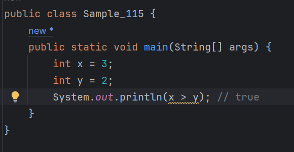
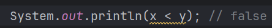
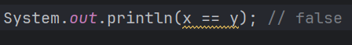
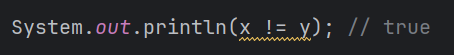
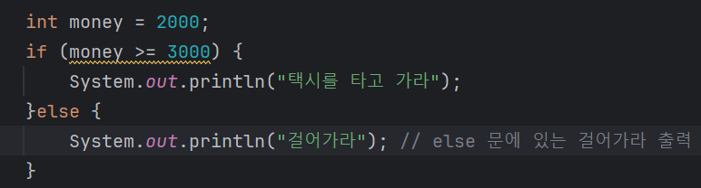
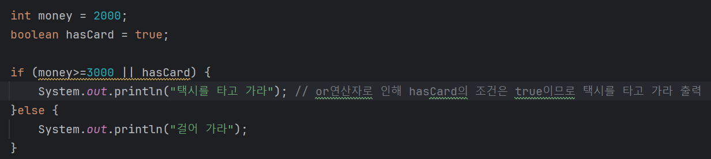
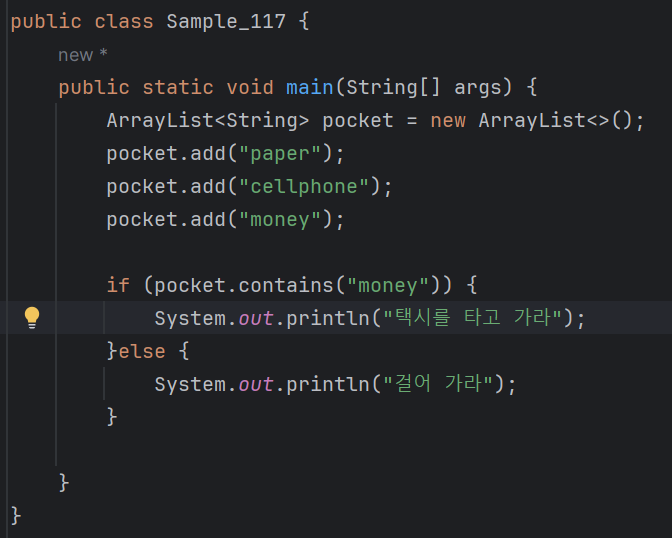
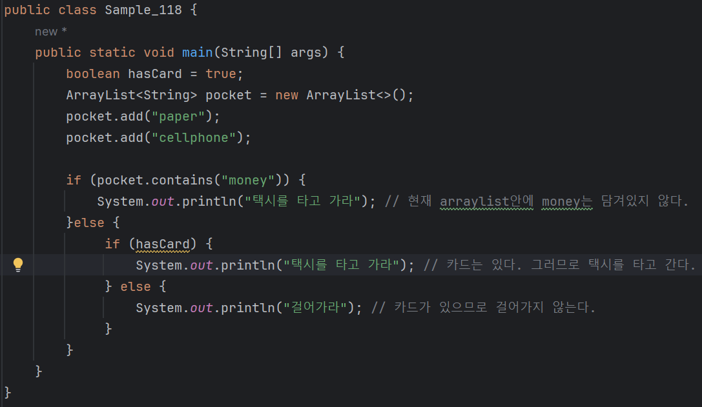
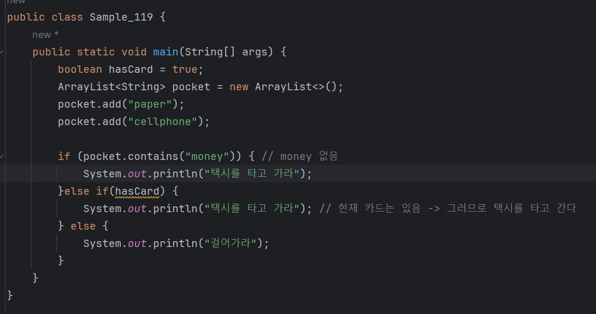

# 04-1 if문

### 다음과 같은 상상을 해 보자.
|돈이 있으면 택시를 타고 가고, 돈이 없으면 걸어간다.|
|--|
* 이와 같은 상황은 우리 주변에서 언제든지 일어날 수 있는 상황 중의 하나이다.
* 프로그래밍도 이와 같이 조건을 판단해 상황에 맞게 처리해야 할 경우가 있다.
* 조건을 판단하여 해당 조건에 맞는 상황을 수행하는 데 쓰이는 것이 if문이다.

#### 이와 같은 상황은 다음과 같이 코딩할 수 있다.
```
    boolean money = true;
    if (money) {
        System.out.println("택시를 타고 가라");
    }else {
        System.out.println("걸어가라");
    }        
```

### if 문과 else 문의 기본 구조
* if 문은 주어진 조건이 참일 때 실행되는 코드 블록
* else 문은 if 문의 조건이 거짓일 때 실행되는 코드 블록

```
if (조건문) {
    <수행할 문장1>;
    <수행할 문장2>;
    ...
} else {
    <수행할 문장A>;
    <수행할 문장B>;
    ...
}    
```
* 조건문을 테스트해서 참이면 if 문에 속한 문장들(수행할 문장1, 수행할 문장2)을 수행하고,<br>
조건문이 거짓이면 else 문에 속한 문장들(수행할 문장A, 수행할 문장B)을 수행한다.
* 즉, 조건문은 참과 거짓을 판단하는 문장이다.
* 그러므로 다음 예에서는 money가 조건문이 된다.

```
    boolean money = true;
    if (money) {
    ...
```
* money는 true(참)이기 때문에 if 문에 속한 문장들이 수행될 것이다.

---

### 비교 연산자
#### 조건 및 판단에 사용되는 비교 연산자에 대해 알아보자.
| 비교 연산자 | 설명        |
|---|-----------|
|x < y | x가 y보다 작다 |
|x > y | x가 y보다 크다 | 
|x == y | x와 y가 같다 |
|x != y | x와 y가 같지 않다 |
|x >= y | x가 y보다 크거나 같다 |
|x <= y | x가 y보다 작거나 같다 |

#### 간단한 예를 통해서 비교 연산자들에 대해서 더 자세히 알아보자.

* x에 3, y에 2를 대입한 후 x > y 라는 조건문을 출력하니 true가 출력된다.
* 당연히 x가 y보다 값이 크기 때문이다.<br>
<br>
#### 앞서 본 코드와 달리 다음 조건문은 거짓이기 때문에 false가 출력된다.


#### x와 y는 같지 않다. 따라서 다음 조건문은 거짓이다.


#### x와 y는 같지 않다. 하지만 이번 조건문은 참이 된다.


#### 앞서 살펴본 택시 예제를 다음과 같이 바꾸어 보자.
| "만약 3000원 이상의 돈을 가지고 있으면 택시를 타고, 그렇지 않으면 걸어가라."|
|---|

* money >= 3000이란 조건문이 거짓이 되기 때문에 else 문의 문장이 수행되어 '걸어가라'가 출력된다.

---

### and, or, not 연산자조건 및 판단에 쓰이는 and,or,not 연산자가 있다.
### 각각의 연산자에 대한 설명은 다음과 같다.

| 연산자    | 설명                       |
|--------|--------------------------|
| x && y | x와 y 모두 참이여야 참이다         |
| x ll y | x와 y 둘 중 적어도 하나가 참이면 참이다 |
| !x | x가 거짓이면 참이다              | 

* and 연산자 - &&
* or 연산자 - ||
* not 연산자 - !

#### 이번에는 다음과 같은 상황을 코딩해 보자.
| "돈이 3000원 이상 있거나 카드가 있다면 택시를 타고, 그렇지 않으면 걸어가라." |
|---|

* money는 2000으로 3000보다 작지만 hasCard가 true이기 떄문에,
  - money >= 3000 || hasCard 조건문이 참이 되어 '택시를 타고 가라'가 출력된다.

---

### contains
#### List 자료형에 해당 아이템이 있는지 조사하는 contains 메서드가 있다.
#### 특히 contains 메서드는 조건문에 많이 활용되는데 어떻게 활용되는지 살펴보자.
#### 그러기 위해 다음의 상황을 코딩해 보자.
|"만약 주머니에 돈이 있으면 택시를 타고, 없으면 걸어가라."|
|---|

* pocket 리스트에 안에 money란 요소가 있으므로,
  - pocket.contains("money")가 참이 되어 '택시를 타고 가라'가 출력된다.

---
### else if
#### if와 else만으로는 다양한 조건 및 판단을 하기가 어렵다.
#### 다음과 같은 예만 하더라도 if와 else만으로도 조건 및 판단에 어려움을 겪게 된다.
| "지갑에 돈이 있으면 택시를 타고, 지갑엔 돈이 없지만 카드가 있으면 택시를 타고, 돈도 없고 카드도 없으면 걸어가라." |
|---------------------------------------------------------------------|
* 이 문장을 보면 조건을 판단하는 부분이 두 군데가 있다.
* 먼저 지갑에 돈이 있는지를 판단해야 하고, 지갑에 돈이 없으면 다시 카드가 있는지를 판단한다.
* if와 else만으로 이 문장대로 코딩한다면 다음과 같다.


* if와 else가 여러 번 사용되어 한 번에 이해하기가 쉽지 않고 산만한 느낌이 든다.
* 이를 보완하기 위해서 자바에는 여러 조건을 판단할 수 있게 하는 else if문이 있다.

#### 다음은 else if문을 적용해 수정한 코드이다.


* else if는 이전 조건문이 거짓일 때 수행된다.
* 따라서 여기서 pocket.contains("money")조건은 거짓이므로 else if 문이 수행되고,
  - hasCard 조건은 true이므로 '택시를 타고 가라'가 출력된다.

#### if, else if, else의 기본 구조는 다음과 같다. 이떄 else if는 개수에 제한 없이 사용할 수 있다.
```
if (조건문) {
    <수행할 문장1>
    <수행할 문장2>
    ...
} else if (조건문) {
    <수행할 문장1>
    <수행할 문장2>
    ...
} else if (조건문) {
    <수행할 문장1>
    <수행할 문장2>
    ...
    
} else {
    <수행할 문장1>
    <수행할 문장2>
    ...
}        
        
```


