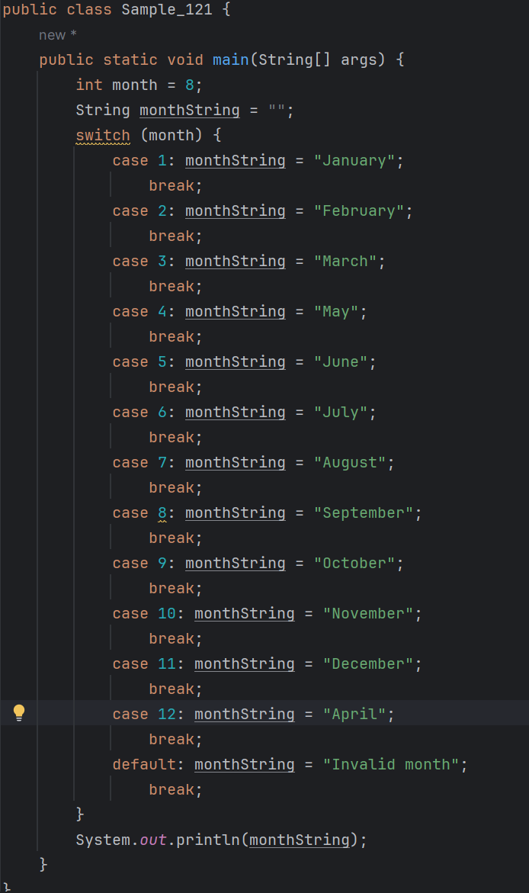

# 04-2 switch/case 문

#### switch/case 문은 if 문과 비슷하지만 좀 더 일정한 형식이 있는 조건 및 판단문이다.
#### switch/case 문의 구조는 다음과 같다.
```
switch(입력 변수){
    case 입력값1: ...
        break;
    case 입력값2: ...
        break;
        
    ...
    default: ...
        break;
}                
```
* 입력 변수의 값과 일치하는 case 입력값(입력값1, 입력값2 등)이 있다면 해당 case 문에 속한 문장들이 실행된다.
* case 문마다 break라는 문장이 있는데 해당 case 문을 실행한 뒤 switch문을 빠져나가기 위한 것이다.
* 만약 break 문이 빠져 있다면 그 다음의 case 문에 속한 문장들이 실행된다.

#### switch/case 문을 가장 잘 설명해주는 다음의 예를 보자


* switch 문의 입력이 1이면 January라는 문자열이, 12면 December라는 문자열이 출력되는 예제이다.
* 이 예제는 month가 8로 고정되어 있기 때문에 August가 출력될 것이다.
* switch문은 month의 값이 1이면 case 1: 문장이 실행되고 2이면 case 2: 문장이, 3이면 case 3: 등 
  - 이외의 숫자가 아닌 다른 값이 저장되어 있다면 default:문장이 수행된다.
* 이와 같이 입력값이 정형화되어 있는 경우 if문보다는 switch/case문을 쓰는것이 코드의 가독성이 좋다.