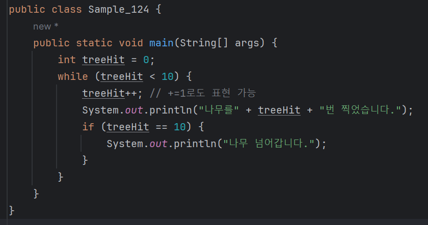
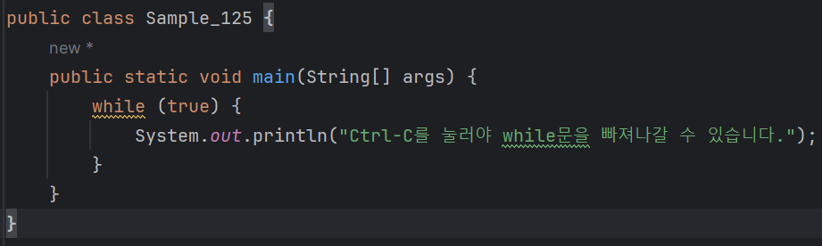
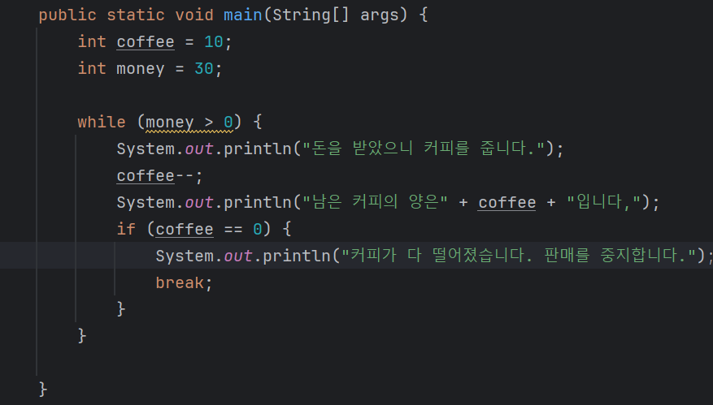
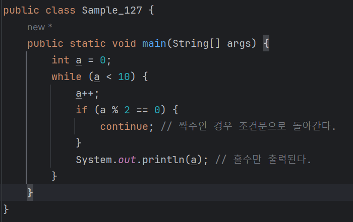

# 04-3 while문
#### while 문은 문장을 반복해서 수행해야 할 경우에 사용한다.

### while 문의 기본 구조
#### 다음 while문의 기본 구조를 살펴보자.
```
while (조건문) {
    <수행할 문장1>;
    <수행할 문장2>;
    <수행할 문장3>;
    ...
```
* 조건문이 참인 동안 while 문이 수행할 문장들을 반복하여 수행한다.

<b>'열 번 찍어 안넘어가는 나무 없다'는 속담을 while 문을 활용해 코딩하면 다음과 같다.</b>

* treeHit++과 같이 변수와 ++의 조합은 프로그래밍에서 자주 등장한다.
* treeHit의 값을 1만큼씩 증가시킨다는 의미이다.
* while문의 조건문은 treeHit < 10이다. 즉, treeHit가 10보다 작은 동안에는 while 문 안의 문장을 계속 수행한다.
* while문 안의 문장을 보면 제일 먼저 treeHit++로 treeHit값이 계속 1씩 증가한다.
* 그리고 나무를 treeHit번만큼 찍었음을 알리는 문장을 출력하고 treeHit가 10이 되면 '나무 넘어갑니다'라는 문장을 출력하고,
  - 이제 조건문은 거짓이 되어 while문을 빠져 나가게된다.

---

### 무한 루프란?
* 무한 루프는 무한히 반복한다는 의미이다.
* 자바에서 무한 루프는 while문으로 구현할 수 있다.
* 우리가 사용하는 프로그램들 중에서 무한 루프의 개념을 사용하지 않는 프로그램은
  - 하나도 없을 정도로 무한 루프는 자주 사용한다

<b>다음은 무한 루프의 기본적인 형태이다.</b
```
while (true) {
    <수행할 문장1>;
    <수행할 문장2>;
    ...
}    
```

* 조건문 자체가 true이므로 조건문은 향상 참이된다.
* while은 조건문이 참인 동아안에 while문에 속해있는 문당들(수행할 문장1, 수행할 문장2)를 계속해서 수행하므로,
  - 무한하게 while 문 내의 문장들을 수행한다.


* 이 문장은 영원히 출력될 것이다. Ctrl + C를 눌러서 빠져나가도록 하자.

---

### while 문 빠져나가기 - break
<b>while문은 조건문이 참인 동안 while문 안의 내용을 반복하여 수행한다.<br>
하지만 강제로 while문을 빠져나가야 할 때도 있다.<br>
예를 들어 커피 자판기를 생각해본다. 커피가 자판기 안에 충분하게 있을 때는 <br>
항상 '돈을 받으며 커피를 줍니다'라는 조건문을 가진 while문이 수행된다.<br>
자판기가 제 역할을 하려면 커피의 양을 따로 검사해서 커피가 다 떨어지면 while문을 멈추게 하고,<br>
'판매중지'란 문구를 자판기에 보여야 할 것이다.<br>
이렇게 while문을 강제로 멈춰야 할 때 사용하는 것이 바로 break이다.<b>

#### 다음은 앞서 설명한 커피 자판기 예를 break를 사용해 작성한 것이다.

```
실행결과 : 
돈을 받았으니 커피를 줍니다.
남은 커피의 양은9입니다,
돈을 받았으니 커피를 줍니다.
남은 커피의 양은8입니다,
돈을 받았으니 커피를 줍니다.
남은 커피의 양은7입니다,
돈을 받았으니 커피를 줍니다.
남은 커피의 양은6입니다,
돈을 받았으니 커피를 줍니다.
남은 커피의 양은5입니다,
돈을 받았으니 커피를 줍니다.
남은 커피의 양은4입니다,
돈을 받았으니 커피를 줍니다.
남은 커피의 양은3입니다,
돈을 받았으니 커피를 줍니다.
남은 커피의 양은2입니다,
돈을 받았으니 커피를 줍니다.
남은 커피의 양은1입니다,
돈을 받았으니 커피를 줍니다.
남은 커피의 양은0입니다,
커피가 다 떨어졌습니다. 판매를 중지합니다.
```
* money가 300으로 거정되어 있으니까 while (money > 0)에서 money는 0보다 크기 떄문에 항상 참이다.
* 따라서 무한 루프가 돌게 되며 while문이 수행되면 coffee--에 의해서 coffee의 개수가 한 개씩 줄어들게 된다.
* 무한 루프가 돌다가 만약 coffee가 0이 되면 if(coffee == 0) 문장이 참이 되므로 break가 호출되어 while문을 빠져나간다.
#### 참고) break 문은 switch/case 문에서도 쓰이고 무한 루프에서도 쓰인다.

---

### while 문으로 돌아가기 - continue
<b>while 문 안의 문장을 수행할 때 어떤 조건을 검사해서 참이 아닌 경우<br>
while 문을 빠져나가는 대신 while 문의 맨 처음, 즉 조건문으로 돌아가게 하고 싶은 경우도 있다.<br>
<br>
1부터 10까지의 수 중에서 홀수만을 출력하도록 while 문을 이용해서 작성해 보자.<br>
어떤 방법이 좋을까? 이때 continue를 사용해 보자.


```
실행 결과 : 
1
3
5
7
9
```
* a가 10보다 작은 동안 a는 1만큼씩 계속 증가한다.
* if (a % 2 == 0) (즉, 2로 나누었을 때 나머지가 0이라면)이 참이 되는 경우는 a가 짝수일 때이다.
* 즉, a가 짝수이면 continue 문장이 수행된다.
* 이 continue 문은 while 문의 맨 처음(조건문인 a < 10)으로 돌아가게 하는 명령어이다.
* 따라서 a가 짝수이면 System.out.println(a)는 수행되지 않기 떄문에 홀수만 출력될 것이다.
