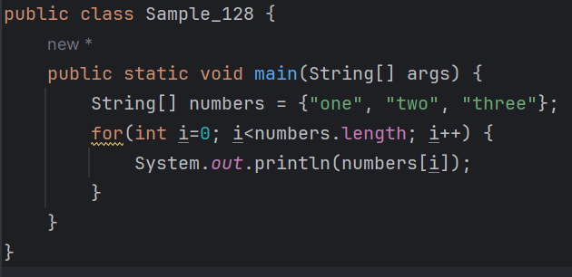
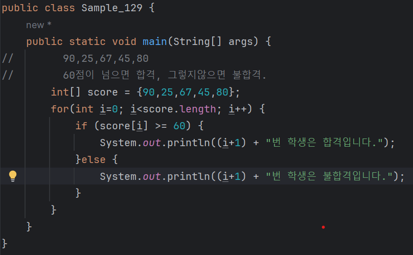
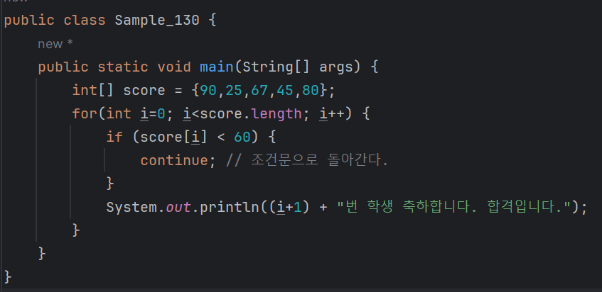
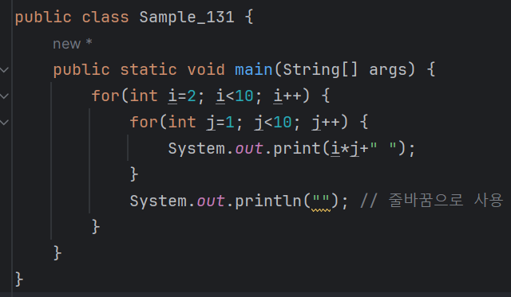

# 04-4 for 문
#### for 문도 while 문과 마찬가지로 문장을 반복해서 수행해야 할 경우에 사용한다.

### for 문의 기본 구조
<b>for 문은 예제를 통해서 알아보는 것이 가장 쉽다.<br>
다음은 numbers 배열의 첫 번째 요소부터 마지막 요소까지 출력하는 예제이다.</b>


```
실행 결과 : 
one
two
three
```
<b>예제에서 알 수 있듯이 for 문의 조건문은 세미콜론(;)을 구분자로 세 부분으로 나누어진다.</b>
```
for (초기값; 조건문; 증가값) {
    ...
}    
```
* 예제로 다시 돌아가면 초기값은 int i=0, 조건문은 i<numbers.length, 증가값은 i++가 된다.
* 즉 i값이 numbers의 개수보다 작은 동안 계속 i값을 1씩 증가시키며 for문의 문장들을 수행한다는 의미이다.

<b>for문의 쓰임새를 이해하기 위해 다음을 가정해보자</b>

| "총 5명의 학생이 시험을 보았는데 시험 점수가 60점이 넘으면 합격이고, 그렇지 않으면 불합격이다." |
|----------------------------------------------------------|
| "합격, 불합격을 판단하여 출력하시오."                                     |
#### 우선 학생 5명의 시험 성적이 다음과 같다고 하자.
| 90 | 25 | 67 | 45 | 80 |
|---|---|---|---|---|
<b>이떄 첫 번쨰 학생의 점수는 90점이고 다섯 번째 학생의 점수는 80점이다.<br>
이런 점수를 차례대로 검사하여 합격 여부를 알려 주는 프로그램을 만들어보자.</b>



```
실행 결과 : 
1번 학생은 합격입니다.
2번 학생은 불합격입니다.
3번 학생은 합격입니다.
4번 학생은 불합격입니다.
5번 학생은 합격입니다.
```

* i값이 0부터 시작하여 1씩 증가하며 for 문 안의 문장들이 수행된다.
* 따라서 score[i]는 차례로 90,25,67,45,80의 값을 갖게 된다.
* score[i]가 60 이상이면 합격 메시지를 출력하고 60을 넘지 않으면 불합격 메시지를 출력한다.
* 그리고 i가 score의 개수인 5보다 크게 되면 for문이 중지된다.

---

### for 문으로 돌아가기 - continue
<b>while 문에서 살펴본 continue는 for 문에도 동일하게 적용된다.<br>
즉, for 문 안의 문장을 수행하는 도중에 continue 문을 만나면 for 문의 처음으로 돌아간다.<br>
<br>
앞서 합격 여부를 알려 주는 예제를 그대로 활용해서 60점 이상인 사람에게는<br>
축하 메시지를 보내고 나머지 사람에게는 아무런 메시지도 전하지 않는 프로그램을 만들어보자</b>



```
실행 결과 : 
1번 학생 축하합니다. 합격입니다.
3번 학생 축하합니다. 합격입니다.
5번 학생 축하합니다. 합격입니다.
```
* 점수가 60점 미만인 학생일 경우에는 score[i] < 60이 참이 되어 continue 문이 수행된다.
* 따라서 축하 메시지를 출력하는 부분을 수행하지 않고 for 문의 첫 부분으로 돌아가게 된다.
#### 참고) continue 문은 반복문과 함꼐 쓰인다.
#### 반복문을 수행할 때, 특정 조건에서는 수행하지 않고 건너뛰어야 할 때 사용한다.

---

### 이중 for 문
<b>for 문을 두 번 사용하면 아주 간단하게 구구단을 출력할 수 있다.</b>

```
실행 결과 : 
2 4 6 8 10 12 14 16 18 
3 6 9 12 15 18 21 24 27 
4 8 12 16 20 24 28 32 36 
5 10 15 20 25 30 35 40 45 
6 12 18 24 30 36 42 48 54 
7 14 21 28 35 42 49 56 63 
8 16 24 32 40 48 56 64 72 
9 18 27 36 45 54 63 72 81 
```
### 설명
* for가 두 번 사용되었다. 먼저 2부터 9까지의 숫자가 차례로 i에 대입된다.
* i가 처음 2일 때 다시 for 문을 만나게 된다.
* 이제 1부터 9까지의 숫자가 j에 대입되고 그 다음 문장인 Systme.out.print(i*j+" ")를 수행한다.
* 따라서 i가 2일 때 2*1, 2*2, 2*3 ,,, 2*9까지 차례로 수행되며 그 값을 출력한다.
* 그 다음은 i가 3일 때, 2일 때와 마찬가지로 수행되고, i가 9일 때까지 계속 반복하게 된다.
<br>
<br>

* 코드를 다시 보면 print와 println을 구분하여 사용했다.
* print는 줄바꿈 문자(\n)을 포함하지 않고 출력하고 println은 마지막에 줄바꿈 문자(\n)을 포함하여 출력하는차이가 있다.
* 즉, 2단, 3단처럼 한 단이 끝날 때만 줄바꿈 문자를 출력하기 위해 이와 같이 구분하여 사용한 것이다.
