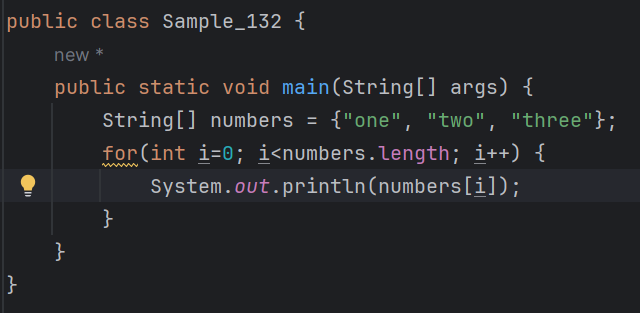
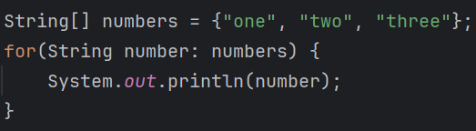
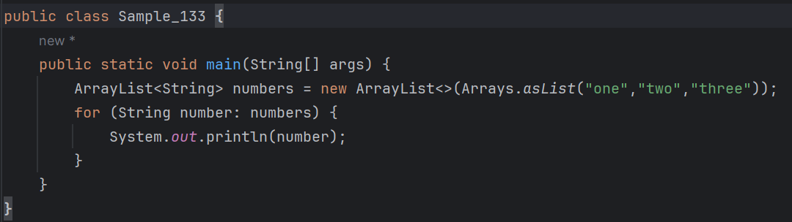

# 04-5 for each 문
<b>for each라는 키워드가 따로 있는 것은 아니고 앞서 배운 for 문을 이용한다.<br>
하지만 조건문의 문법이 조금 다르다.<br>
for 문을 활용한 예제를 살펴보자<br>


```
실행 결과 : 
one
two
three
```

<b>for 문은 다음과 같이 for each 문으로 변경할 수 있다.</b>

```
실행 결과 : 
one
two
three
```

###  for each 문의 구조는 다음과 같다.
```
for (type 변수명 : iterate) {
    body-of-loop
}    
```
* iterate는 루프를 돌릴 객체이고 iterate 객체에서 한 개씩 순차적으로 변수명에 대입되어 for 문이 수행된다.
* iterate에 사용할 수 있는 자료형은 루프를 돌릴 수 있는 자료형(배열이나 ArrayList 등)만 가능하다.
* 그리고 변수명의 type(자료형)은 iterate 객체에 포함된 자료형과 일치해야 한다.

#### 다음은 ArrayList로 구현한 예제이다. for문의 사용법은 String[] 배열을 사용했을 때와 동일하다.

* 단, for each 문은 따로 반복 횟수를 명시적으로 주는 것이 불가능하고,
  - 한 단계씩 순차적으로 반복할 때만 사용이 가능하다는 제약이 있다.